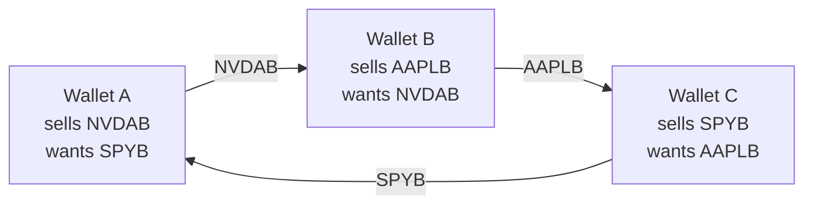

<picture>
  <source media="(prefers-color-scheme: dark)" srcset="https://raw.githubusercontent.com/sama-fi/.github/HEAD/profile/logo-dark.svg">
  
</picture>

### Find the other side of your rebalance.

**Wallet-to-wallet matching for tokenized stocks on BNB Chain.**

[Website](https://samafi.xyz) &nbsp;·&nbsp; [App](https://app.samafi.xyz) &nbsp;·&nbsp; [Docs](https://docs.samafi.xyz) &nbsp;·&nbsp; [On-chain proof](https://samafi.xyz/proof)

---

## The problem

Tokenized US stocks, Binance **bStocks** such as NVDAB, TSLAB and AAPLB, now trade on BNB Chain. But every wallet that rebalances goes to a liquidity pool on its own, and pays the pool's fee, spread and price impact on each trade, even when another holder wants exactly the opposite.

Liquidity is also thin and uneven. Only 18 of the 88 bStocks have a PancakeSwap V3 pool holding $100K or more of USDT, and a $10K swap costs from about 0.3% in the deepest pool to several percent in the thinnest (PancakeSwap V3 quotes, October 2026).

## What SAMA does

SAMA groups wallets into **Circles**, such as a community, a Telegram investment group or friends, that rebalance the same assets on a schedule. Each round:

1. **Set a target.** Pick a preset, type percentages, describe it in plain words, or review a proposal from the AI assistant.
2. **Lock one price snapshot** (Binance Web3 RWA API, cross-checked against a PancakeSwap V3 TWAP where a liquid pool exists) and **sign an intent**. Signing is free and moves no tokens.
3. **Match.** A min-cost circulation matcher finds every part of those rebalances that cancels out, including **rings of three or more wallets** that pairwise venues cannot see.
4. **Approve and settle.** Each member approves the exact plan, and the `SamaSettlement` contract moves every transfer **wallet to wallet in one atomic transaction**. Either every leg settles or none does.
5. **Verify.** An independent verifier re-reads the settlement from a separate RPC after finality and issues a receipt.
6. **Handle the rest.** Whatever did not match is carried to the next round, cancelled, or swapped on PancakeSwap V3 from the user's own wallet, only when the cost stays under the user's cap.

No two of these wallets fit together, yet all three do. SAMA settles the whole ring in one transaction and no pool is touched.

## How it is different

| | Typical DEX or order book | SAMA |
|---|---|---|
| Who you trade with | The pool, at the pool's price | Other wallets heading the opposite way, at one shared snapshot price |
| Multi-party trades | Pairwise only | Rings of three or more wallets, settled together |
| Cost of the matched part | Pool fee, spread and price impact | No pool fee, spread or price impact. Only network gas applies |
| Custody | Tokens sit in the pool | Never. The contract holds no funds |
| Failure mode | Partial fills, slippage | All or nothing |
| Proof | A swap receipt | An independent verifier re-reads every settlement |
| AI | None, or an agent that trades for you | An agent that only reads and proposes. You approve every change |

## Live on BNB Chain

| | |
|---|---|
| **Network** | BNB Smart Chain mainnet (chain 56) |
| **Contract** | [`SamaSettlement` · `0x7811…2AC8`](https://bscscan.com/address/0x7811a30D29d6c2Ca95Aeb4EE9D896cE44Cb72AC8) |
| **Verification** | Source verified on [BscScan](https://bscscan.com/address/0x7811a30D29d6c2Ca95Aeb4EE9D896cE44Cb72AC8#code) and [Sourcify](https://repo.sourcify.dev/56/0x7811a30D29d6c2Ca95Aeb4EE9D896cE44Cb72AC8) (exact match) |
| **Assets** | 88 bStocks (75 stocks, 13 ETFs), WBNB and USDT |
| **Safety cap** | Plans are capped at $500 while the contract is unaudited |

## Repositories

| Repository | What it is |
|---|---|
| [**sama-frontend**](https://github.com/sama-fi/sama-frontend) | The web app, landing page and documentation. Next.js 16, React 19, Privy sign-in with email or wallet, mobile-first, English and Bahasa Indonesia |
| [**sama-backend**](https://github.com/sama-fi/sama-backend) | The API on Bun and Elysia: sessions, targets, Circles, the round state machine, leftovers, proof, market data and the AI assistant |

## Built with

- **Contract:** Solidity 0.8.33 and Foundry, with 33 unit tests (including fuzzing) and 22 mainnet-fork tests on real bStocks
- **Backend:** Bun, Elysia and viem
- **Frontend:** Next.js, React and Privy
- **Prices:** Binance Web3 RWA API, with PancakeSwap V3 TWAP as the on-chain guard
- **AI assistant:** a tool-calling agent that reads the user's own data and proposes actions, and never moves funds on its own

## Status

SAMA is early-stage software. The settlement contract is live on BNB Chain mainnet and **has not been externally audited**, which is why plans are capped at $500. Users currently pay their own network gas, and gas sponsorship is planned.

SAMA coordinates the trades you choose. It gives no investment advice and does not decide whether you may trade an asset.

---

Built by **NGDKLabs** &nbsp;·&nbsp; *SAMA* means "the same" and "together" in Indonesian.

